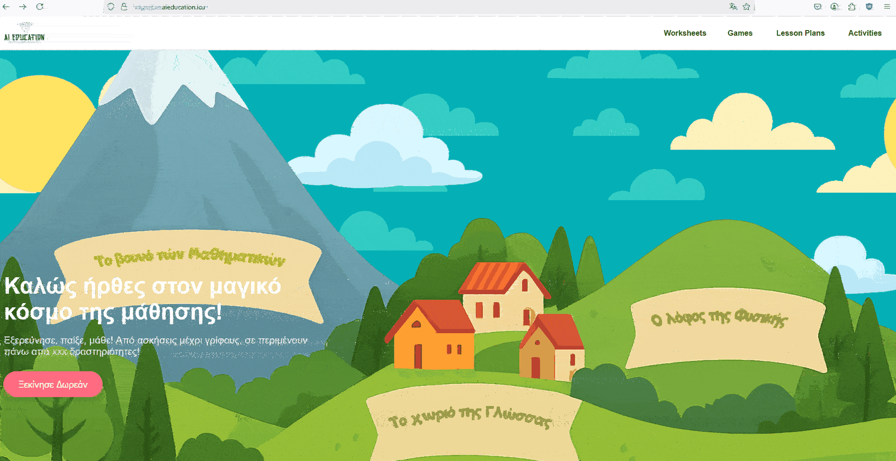

# 📚 Proof of Concept for RAG-Based Educational Application 

This project is part of the Master's thesis of students Antonis Kaparos and Harilaos baris at International Hellenic University.

It is a proof of concept of an educational platform that utilizes the Retrieval-Augmented Generation (RAG) technique to answer questions based solely on the content of selected school textbooks.

Currently, it includes two knowledge sources:

    The Greek 5th Grade Geography textbook

    The educational material on the life and work of Aristotle

Users can interact with the system via chat or quizzes (free text and multiple choice), and the responses are generated exclusively based on the content of the above materials.

You can access the live app :  
👉 [here](https://ab.aieducation.icu)

  

---

## 🎯 Purpose

The goal of this project is to **demonstrate how Large Language Models (LLMs)** can be safely and accurately used in educational contexts when paired with official academic sources, using the **RAG architecture**.

This is **not a complete product**, but a **proof of concept** showing how LLMs can be enhanced with textbook-based knowledge without retraining the models.

---

## 📘 Content Scope

- The model’s knowledge is **strictly limited** to the **Greek 5th Grade Geography textbook**.
- A similar implementation has been developed for the **life and work of Aristotle**.
- For now, the system **only responds in Greek**, but support for other languages is planned soon.

---

## ✨ Features

🔹 **Chat Interaction**  
Ask questions directly to the model about the textbook content.  
*⚠️ The model can only respond with information from the textbook.*

🔹 **LLM-driven Q&A Quiz**  
The model asks open-ended questions to test your knowledge, simulating an interactive teacher.

🔹 **Multiple-Choice Quizzes**  
Test your understanding through ready-made multiple-choice questions.

🔹 **Model Selection**  
You can choose from:
- **Gemini models**
- **Groq-powered models** (e.g., LLaMA, Mixtral, Gemma)

---

## 🔍 Understanding RAG: Retrieval-Augmented Generation

**Retrieval-Augmented Generation (RAG)** is an advanced architecture designed to enhance the performance of Large Language Models (LLMs) by enabling them to access and utilize external sources of information such as PDF files, text documents, databases, or even video transcripts. Unlike traditional LLMs that rely solely on their training data, RAG empowers models to retrieve relevant, up-to-date knowledge from vector databases in real time, making their responses more accurate, relevant, and context-aware.

---

## 🧠 Why is RAG Necessary?

While LLMs are powerful tools, they come with inherent limitations:

- Their knowledge is **static** and limited to the data they were trained on.
- They are prone to **hallucinations**—fabricating plausible-sounding but incorrect answers.
- They **struggle** to provide domain-specific, updated, or contextual information.

RAG addresses these problems by **combining generation with real-time retrieval**. Instead of retraining a model every time new information becomes available, RAG allows the system to pull the latest and most relevant data from external sources **on demand**, without modifying the core model.

---

## 💼 Business Benefits of RAG

For businesses, adopting RAG can significantly boost efficiency and insight generation across multiple sectors:

- ✅ **Customer Support**: Deliver accurate, timely answers by retrieving data from internal documentation or product manuals.
- ✅ **Legal & Compliance**: Automatically source policies and laws to support legal interpretations or compliance checks.
- ✅ **HR & Internal Ops**: Empower employees with self-service access to company policies, onboarding docs, and training material.
- ✅ **Market Intelligence**: Combine internal reports with live data to generate up-to-date market analysis.

By using RAG, businesses can ensure **consistent, reliable, and scalable knowledge delivery**, reducing manual effort and increasing user satisfaction.

---

## 📦 How It Works: Embeddings, Indexing, and Retrieval

At the core of RAG lies the use of **embeddings** and **vector databases**:

1. **Embeddings**: Textual data is first transformed into dense numerical vectors using models like Sentence Transformers. These vectors capture the **semantic meaning** of the content.
2. **Indexing**: The generated vectors are stored in a **vector database** (e.g., ChromaDB, FAISS, Pinecone). This allows for fast and scalable similarity search using approximate nearest neighbor (ANN) algorithms.
3. **Retrieval**: When a user submits a query, it is also converted into an embedding and compared against the indexed vectors. The most semantically similar chunks of information are retrieved.
4. **Generation**: These retrieved snippets are then passed along with the query to the LLM, which uses them as **context** to generate a highly relevant and informed response.

---

## ✍️ Prompt Engineering and Continuous Updates

To make RAG even more effective, **prompt engineering** is used to frame the inputs in a way that maximizes the model's understanding and output quality. Additionally, continuous updating of the external data—either periodically or in real-time—ensures that the system always works with **the most current knowledge available**, greatly enhancing reliability and performance.

---

## 🧩 Conclusion

In summary, **RAG transforms LLMs from static knowledge engines to dynamic, context-aware assistants**. With the integration of vector search and real-time retrieval, businesses can leverage the power of AI while ensuring accuracy, freshness, and relevance in every response.

